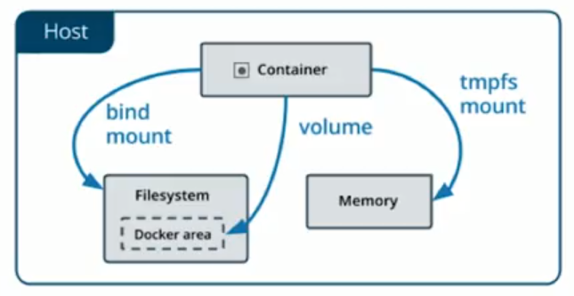

# docker_summary_platzi
Docker Summary Platzi

# Docker
- El PID 1 es el root process y cuando se apaga un contenedor al terminar ese proceso
- Flujo de docker es: DockerFile -> Build -> Image -> Run -> Container

# Comandos
- docker ps = lista los contenedores
- docker ps -a = lista contenedores a detalles
- docker ps -aq = lista solo los ID de los contenedores (la q significa quiet, tranquilo o silencioso)
- docker inspect id_contenedor = detalles internos del contenedor
- docker inspect nombre_contenedor = lo mismo que el anterior
- docker inspect -f {{}} nombre_contenedor = filtra una variable especifico del contenedor
- docker rm nombre_contenedor = elimina un contenedor
- docker rm $(ps -aq) = borra TODOS los contenedores
- docker exec it nombre_contenedor bash
- docker kill nombre_contenedor = mata el proceso completo
- docker rm -f nombre_contenedor = forzar la eliminación del contenedor
- **docker volume prune = Limpia volumenes q ya no estan usando los contenedores**
- docker image ls
- docker pull {nombre de la imagen}
- 

### **Modo interactivo**

Ejemplo para crear un ubuntu:

docker run ubuntu

docker run -it ubuntu —> Com esto le decimos que corra el comando pero que lo haga de forma interactiva con mi terminal. Así el estado del contenedor no será apagado sino prendido.

ls - lac —> Puedo ver los archivos, para comprobar que estoy en un linux.

uname -a —> para saber los detalles.

cat /etc/lsb-release —> La data de que linux estamos corriendo.

exit —> matando sesión del contenedor y de esta forma el estado cambio a Exited.

Después de cerrar ya no consume recursos.

## Manejo de Datos

### Bind mount
Persistir datos tipo bind mount:
docker run --name db -d -v /Users/gvilarina/Dev/platzi/mongodata:/data/db mongo

En docker inspect se puede ver q volumenes pegados hay y el mount de donde esta

### Volume
Crear volúmenes en el host (Mejorado)

docker volume create {nombre del volumen}

docker run -d --name {nombre del contenedor} —mount src={nombre del volumen},dst= {carpeta datos contenedor} {nombre de la imagen}

Ej:docker volume create dbdata
Ej:docker run -d --name mongo-db --mount src=dbdata,dst=/data/db mongo

Se puede seleccionar un volumen por fuera de la maquina, selecccionando un driver (S3, etc)

https://docs.docker.com/storage/

### tmpfs mount
Montar data en memoria del docker (RAM)



# Imagenes
Las imágenes son un componente fundamental de Docker y sin ellas los contenedores no tendrían sentido. Estas imágenes son fundamentalmente plantillas o templates.
Algo que debemos tener en cuenta es que las imágenes no van a cambiar, es decir, una vez este realizada no la podremos cambiar.

Conjunto de Layers, capa base y capaz encima de esa capa.
Cada capa es inmutable.
Similar a git.

Docker Hub - Repositorios

## **Imagenes Propias (DockerFile)**
Siempre tiene q comenzar con un FROM imagen_base
```bash
FROM ubuntu 
RUN touch /user/bin/hola-mundo
```

Luego se le da

docker build -t ubuntu:platzi {contexto de build. Contenido en el directorio. Q puede usar}

### Subirlas al repo personal
- docker tag ubuntu:platzi {camilo repo}/ubuntu:platzi
- docker push {camilo repo}/ubuntu:platzi

Asi queda en mi repo personal en Docker

# Como correr un contenedor de nginx
docker run --detach --name server nginx

-d o --detach —> Si el contenedor que voy a ejecutar tiene un proceso que tiene output y/o pretende correr en modo interactivo, lo va omitir, me va dar el control de la terminal.

Después de ejecutar el proceso, el ultimo número largo que aparece en la terminal esta en formato SHA, lo usa docker para generar los números de IDs únicos.

El ID del contenedor son los primeros números del SHA.

Aparece PORTS (Esta exponiendo un puerto para que se comuniquen con el).

Los contenedores también están aislados a nivel de red. El que un contenedor tenga un puerto abierto no implica que ese puerto este abierto en la maquina esperando por conexiones hacia ese contenedor. Lo que tenemos que hacer es decirle explícitamente que desde tal puerto de mi computadora vaya hacia el puerto del contenedor.

docker run -d --name server -p 8080:80 nginx

-p —> esta bandera es para atar los puertos. Primero el de mi maquina y después el del contenedor.

Ahora en PORTS aparece que puerto de mi maquina está dirigiendo hacia el puerto del contenedor.

En el navegador localhost:8080 y ya puedo ver nginx.

No puedo asignar más de un contenedor a un mismo puerto.

## Qué es Docker?
Docker Permite resolver problemas de construir, distribuir y ejecutar software en diferentes plataformas.

- Containarization: un estándar para llevar algo dentro. Agrupadores de procesos.

- Versátiles:
En el orden de los MB
Tienen todas las dependencias que necesitan para funcionar correctamente.
Funcionan igual en todos lados.

- Eficientes:
Comparten archivos simultáneos con otros contenedores.
Solo se ejecutan procesos, no un SS.OO completo.

- Aislados:
Lo que pasa en el container queda en el container.
No pueden alterar su entorno de ejecución (a menos que explícitamente se indique lo contrario)

- Virtualization: es una imagen o archivo que contiene información dentro. Por lo general son pesadas de administración costosa y son lentas.

- Pesadas:
En el orden de los GB
Muchas VMs en el mismo host suelen repetirse en lo que contienen
Administración costosa:
Una VM tiene que ser administrada como cualquier otra computadora: patching, update, etc
Hay que administrar la seguridad interna entre apps

- Lentas:
Correr nuestro código en una VM implica no solo arrancar aplicaciones, sino también esperar el boot de la VM en sí.

## Que es un contenedor ?

Es la pieza fundamental de docker.
Es una agrupación de varios procesos. También puede ser un solo proceso.
Los procesos que se definen para un contenedor, solo pueden vivir en el contexto de ese contenedor.
Los procesos usarán los recursos que el contenedor defina.
Los procesos corren de forma nativa en máquinas linux, lo único que se comparte es el kernel. por eso en ambientes productivos se usa linux con docker.
No son máquinas virtuales.